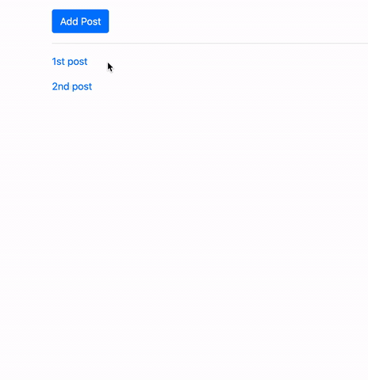

# Django_Inlineformset


[referred blog](https://narito.ninja/blog/detail/32/)



> ## models.py
``` python
from django.db import models
from django.utils import timezone

class Post(models.Model):
    title = models.CharField('title', max_length=200)
    text = models.TextField('content')
    date = models.DateTimeField('date', default=timezone.now)

    def __str__(self):
        return self.title

class File(models.Model):
    name = models.CharField('file name', max_length=255)
    src = models.FileField('attach file')
    target = models.ForeignKey(
        Post, verbose_name='related post',
        blank=True, null=True,
        on_delete=models.SET_NULL
    )
```

> ## admin.py
``` python
from django.contrib import admin
from .models import *

# To use inlineformset in admin site
# You can use either StackedInline or TabularInline as you like

class FileInline(admin.StackedInline):
    model = File
    extra = 3

# class FileInline(admin.TabularInline):
#     model = File
#     extra = 3

class PostAdmin(admin.ModelAdmin):
    inlines = [FileInline]


admin.site.register(Post, PostAdmin)
admin.site.register(File) 
```

> ## views.py
``` python
from django.shortcuts import render, redirect, get_object_or_404
from django.views import generic
from .forms import PostCreateForm, FileFormset
from .models import Post


class PostList(generic.ListView):
    model = Post


def add_post(request):
    form = PostCreateForm(request.POST or None)
    context = {'form': form}
    if request.method == 'POST' and form.is_valid():
        post = form.save(commit=False)
        formset = FileFormset(request.POST, files=request.FILES, instance=post)
        # This time, we are passing files, we need request.FILES
        # We need to define which data is related to which, so we set instance=post here.
        # If you want to relate data to user, we can set it like below.
        # formset = FileFormset(request.POST, files=request.FILES, instance=request.user)
        if formset.is_valid():
            post.save()
            formset.save()
            return redirect('app:index')

        # we store formset with error message in context and it will be passed to template.
        else:
            context['formset'] = formset

    # GET, when we first go to 'add_post' url (add_post view), there is no data in context
    # so we set empty context below. By doing this, contents of formset can be displayed in post_list.html
    else:
        # passing empty formset to template
        context['formset'] = FileFormset()

    return render(request, 'app/post_form.html', context)


def update_post(request, pk):
    post = get_object_or_404(Post, pk=pk)
    form = PostCreateForm(request.POST or None, instance=post)
    formset = FileFormset(request.POST or None, files=request.FILES or None, instance=post)
    if request.method == 'POST' and form.is_valid() and formset.is_valid():
        form.save()
        formset.save()
        # show update page again here
        return redirect('app:update_post', pk=pk)

    context = {
        'form': form,
        'formset': formset
    }

    return render(request, 'app/post_form.html', context)
```

> ## urls.py
``` python

```

> ## forms.py
``` python
from django import forms
from .models import Post, File


class PostCreateForm(forms.ModelForm):

    def __init__(self, *args, **kwargs):
        super().__init__(*args, **kwargs)
        for field in self.fields.values():
            field.widget.attrs['class'] = 'form-control'

    class Meta:
        model = Post
        fields = '__all__'

# This is inlineformset!
# Post is parent models, File it models of inlineformset, in this case here
# max_num can limit mmaximum number of files
FileFormset = forms.inlineformset_factory(
    Post, File, fields='__all__',
    extra=5, max_num=5, can_delete=False
)
```

> ## post_list.html
``` python

```
> ## post_form.html
``` python

```
